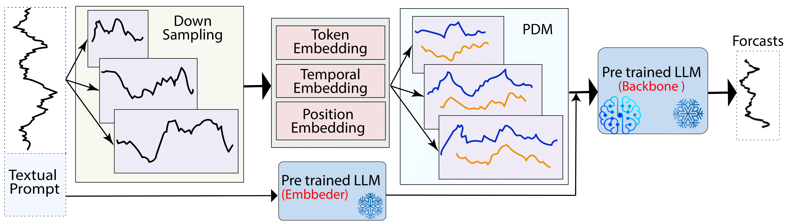

<div align="center">
  <!-- <h1><b> Time-LLM </b></h1> -->
  <!-- <h2><b> Time-LLM </b></h2> -->
  <h2><b> LLM-Mixer: Multiscale Mixing in LLMs for Time Series Forecasting </b></h2>
</div>


<div align="center">


</div>

<div align="center">

**[<a href="https://openreview.net">Paper Page</a>]**
**[<a href="https://github.com/Kowsher/LLMMixer">Code</a>]**


</div>


---
>
> 🙋 Please let us know if you find out a mistake or have any suggestions!
> 
> 🌟 If you find this resource helpful, please consider to star this repository and cite our research:

```
@inproceedings{wang2023timemixer,
  title={TimeMixer: Decomposable Multiscale Mixing for Time Series Forecasting},
  author={Wang, Shiyu and Wu, Haixu and Shi, Xiaoming and Hu, Tengge and Luo, Huakun and Ma, Lintao and Zhang, James Y and ZHOU, JUN},
  booktitle={International Conference on Learning Representations (ICLR)},
  year={2024}
}
```

## Introduction
 LLMMixer is a framework that combines multiscale time series decomposition with large language models to enhance forecasting accuracy by capturing both short-term and long-term temporal patterns.

<p align="center">



</p>

## Requirements
Use Python 3.11 from MiniConda

- torch==2.3.0
- accelerate==0.33.0
- einops==0.7.0
- matplotlib==3.7.0
- numpy==1.23.5
- pandas==1.5.3
- scikit_learn==1.2.2
- scipy==1.12.0
- tqdm==4.65.0
- peft==0.12.0
- transformers==4.44.0
- deepspeed==0.15.1
- sentencepiece==0.2.0


## Get Started

1. Install requirements. ```pip install -r requirements.txt```
2. Download data. You can download the all datasets from [Google Driver](https://drive.google.com/u/0/uc?id=1NF7VEefXCmXuWNbnNe858WvQAkJ_7wuP&export=download), [Baidu Driver](https://pan.baidu.com/share/init?surl=r3KhGd0Q9PJIUZdfEYoymg&pwd=i9iy) or [Kaggle Datasets](https://www.kaggle.com/datasets/wentixiaogege/time-series-dataset). **All the datasets are well pre-processed** and can be used easily.
3. Train the model by following the example of `./scripts`. 


## Acknowledgement

We appreciate the following GitHub repos a lot for their valuable code and efforts.
- Time-Series-Library (https://github.com/thuml/Time-Series-Library)
- TimeMixer ([https://github.com/kwuking/TimeMixer](https://github.com/kwuking/TimeMixer))
- TimeLLM ([https://github.com/thuml/Autoformer](https://github.com/KimMeen/Time-LLM))
- Autoformer (https://github.com/thuml/Autoformer)

